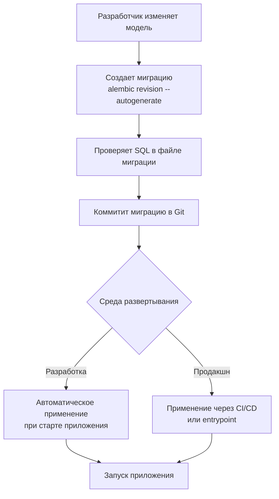

# План внедрения Alembic в auth-service

## Контекст
В файле `services/auth-service/src/db/postgres.py#L70` используется `Base.metadata.create_all` при старте приложения. Это создает таблицы только при первом запуске. При изменении моделей схема БД не обновляется, что приводит к расхождению между кодом и базой данных.

## Решение
Внедрить Alembic для управления миграциями базы данных с автоматическим применением при старте приложения (`alembic upgrade head`).

## Подробный план выполнения

### 1. Добавление зависимостей
**Файл:** `services/auth-service/requirements.txt`
```diff
+ alembic==1.13.1
```

### 2. Инициализация Alembic
Выполнить в терминале:
```bash
cd services/auth-service
alembic init alembic
```

Создаст структуру:
- `alembic/` - директория с миграциями
- `alembic.ini` - конфигурационный файл

### 3. Конфигурация alembic.ini
Обновить `sqlalchemy.url` для использования переменных окружения:
```ini
sqlalchemy.url = postgresql+asyncpg://${POSTGRES_USER}:${POSTGRES_PASSWORD}@${POSTGRES_HOST}:${POSTGRES_PORT}/${POSTGRES_DB}
```

### 4. Настройка env.py для asyncpg
**Файл:** `services/auth-service/alembic/env.py`

Необходимые изменения:
- Добавить импорт `Base` из `db.postgres`
- Настроить `target_metadata = Base.metadata`
- Реализовать async движок для работы с asyncpg

Примерный код:
```python
import asyncio
from logging.config import fileConfig
from sqlalchemy import pool
from sqlalchemy.engine import Connection
from sqlalchemy.ext.asyncio import async_engine_from_config
from alembic import context
import sys
import os

sys.path.append(os.path.join(os.path.dirname(__file__), '..', 'src'))

from db.postgres import Base
from models.entity import User, RefreshToken, LoginHistory, SocialAccount

config = context.config
fileConfig(config.config_file_name) if config.config_file_name else None
target_metadata = Base.metadata

def run_migrations_offline() -> None:
    context.configure(
        url=config.get_main_option("sqlalchemy.url"),
        target_metadata=target_metadata,
        literal_binds=True,
        dialect_opts={"paramstyle": "named"},
    )
    with context.begin_transaction():
        context.run_migrations()

def do_run_migrations(connection: Connection) -> None:
    context.configure(connection=connection, target_metadata=target_metadata)
    with context.begin_transaction():
        context.run_migrations()

async def run_async_migrations() -> None:
    connectable = async_engine_from_config(
        config.get_section(config.config_ini_section, {}),
        prefix="sqlalchemy.",
        poolclass=pool.NullPool,
    )
    async with connectable.connect() as connection:
        await connection.run_sync(do_run_migrations)
    await connectable.dispose()

def run_migrations_online() -> None:
    asyncio.run(run_async_migrations())

if context.is_offline_mode():
    run_migrations_offline()
else:
    run_migrations_online()
```

### 5. Создание первой миграции
```bash
cd services/auth-service
alembic revision --autogenerate -m "Initial migration"
```

Проверить созданный файл в `alembic/versions/`.

### 6. Обновление lifespan приложения
**Файл:** `services/auth-service/main.py`

Заменить блок создания таблиц на применение миграций:

```python
# В начале файла добавить импорт
import subprocess
import os

# В lifespan заменить:
# Было:
# await create_database()
# logger.info("✓ Database tables created successfully")

# Стало:
try:
    # Применяем миграции базы данных
    result = subprocess.run(
        ["alembic", "upgrade", "head"],
        cwd=os.path.dirname(__file__),
        capture_output=True,
        text=True
    )
    if result.returncode == 0:
        logger.info("✓ Database migrations applied successfully")
    else:
        logger.error(f"✗ Failed to apply migrations: {result.stderr}")
        raise Exception(f"Migration failed: {result.stderr}")
except Exception as e:
    logger.error(f"✗ Failed to apply database migrations: {e}")
    raise
```

### 7. Обновление Dockerfile
**Файл:** `services/auth-service/Dockerfile`

Добавить применение миграций через entrypoint скрипт:

```dockerfile
# Добавить в конец Dockerfile:
COPY entrypoint.sh .
RUN chmod +x entrypoint.sh
ENTRYPOINT ["./entrypoint.sh"]
```

Создать `entrypoint.sh`:
```bash
#!/bin/bash
set -e

echo "Applying database migrations..."
alembic upgrade head

echo "Starting application..."
exec uvicorn main:app --host 0.0.0.0 --port 8000
```

### 8. Тестирование
1. Запустить тестовое окружение с PostgreSQL
2. Применить миграции: `alembic upgrade head`
3. Проверить созданные таблицы
4. Добавить тестовую колонку в модель
5. Создать новую миграцию: `alembic revision --autogenerate -m "Add test column"`
6. Применить миграцию и проверить обновление схемы

### 9. Документация
Добавить в `README.md` раздел "Database Migrations":
```markdown
## Database Migrations

This project uses Alembic for database migrations.

### Common commands:
- Create new migration: `alembic revision --autogenerate -m "Description"`
- Apply migrations: `alembic upgrade head`
- Rollback last migration: `alembic downgrade -1`
- Show migration history: `alembic history`
- Check current revision: `alembic current`
```

## Workflow диаграмма



## Следующие шаги после реализации
1. Протестировать в dev-окружении
2. Добавить проверку миграций в CI/CD pipeline
3. Настроить мониторинг состояния миграций
4. Создать скрипты для rollback в emergency случаях

## Примечания
- Первая миграция должна быть совместима с существующими данными (если они есть)
- В продакшн окружении рекомендуется создавать backup перед применением миграций
- Для сложных миграций рекомендуется писать кастомные SQL вместо autogenerate