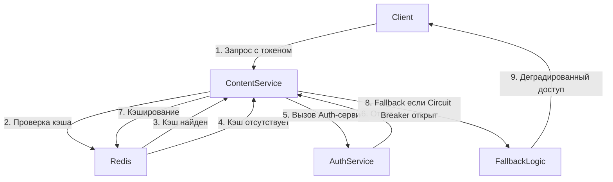

# План выполнения двух этапов из AGENTS.md

## Контекст
Проект представляет собой Auth-сервис на FastAPI с базовой аутентификацией (регистрация, логин, JWT токены). Согласно AGENTS.md необходимо выполнить два этапа:
1. **Анализ и подготовка контракта** - расширение API для OAuth и валидации токенов.
2. **Интеграция с сервисами (Content & Admin) с учетом деградации** - обеспечение отказоустойчивости и rate limiting.

## Текущее состояние
- Auth-сервис работает на FastAPI, есть эндпоинты `/auth/register`, `/auth/login`, `/auth/refresh`, `/auth/logout`.
- Пользовательские эндпоинты в `/users/*` для управления профилем.
- Используется PostgreSQL (пользователи, история входов) и Redis (черный список токенов).
- Отсутствуют эндпоинты для OAuth, introspect, rate limiting, circuit breaker.

## Этап 1: Анализ и подготовка контракта

### 1.1. Review контракта (OpenAPI)
- **Задача**: Создать OpenAPI спецификацию (Swagger) на основе существующих эндпоинтов.
- **Действия**:
  1. Генерация OpenAPI через FastAPI автоматически (уже доступно по `/docs`).
  2. Проверка наличия метода валидации токенов (`introspect`). Если отсутствует — добавить.
  3. Документирование всех существующих эндпоинтов в отдельном файле `openapi.yaml`.

### 1.2. Добавление эндпоинтов для OAuth
- **Задача**: Реализовать OAuth2 flow для провайдеров (Google, Yandex, VK и т.д.).
- **Действия**:
  1. Создать пакет `src/oauth` с провайдерами.
  2. Добавить эндпоинты:
     - `GET /auth/oauth/{provider}` — инициация OAuth (редирект на провайдера).
     - `GET /auth/oauth/callback/{provider}` — обработка коллбэка, создание/привязка пользователя.
  3. Расширить модель `User` полями для хранения OAuth идентификаторов.
  4. Интегрировать с `AuthService` для выдачи JWT после успешной OAuth аутентификации.

### 1.3. Добавление эндпоинта для открепления соцсети
- **Задача**: Позволить пользователю отвязать привязанный OAuth-аккаунт.
- **Действия**:
  1. Добавить эндпоинт `DELETE /user/social/{provider}/unlink`.
  2. Реализовать проверку, что у пользователя остаётся хотя бы один способ входа (логин/пароль или другая соцсеть).
  3. Обновить данные пользователя в БД.

### 1.4. Создание структуры проекта (Clean Architecture)
- **Задача**: Реорганизовать код согласно Clean Architecture.
- **Действия**:
  1. Создать пакеты:
     - `src/auth` — бизнес-логика аутентификации.
     - `src/content` — заглушка для будущей интеграции.
     - `src/admin` — заглушка для админ-панели.
     - `src/oauth` — логика OAuth.
     - `src/middleware` — общие middleware (rate limiting, circuit breaker).
  2. Перенести существующие модули (`services/auth_service.py` → `src/auth/service.py` и т.д.).
  3. Настроить зависимости между слоями (use cases, repositories, entities).

### 1.5. Валидация токенов (introspect)
- **Задача**: Добавить эндпоинт для проверки токена сторонними сервисами.
- **Действия**:
  1. Добавить `POST /auth/introspect` принимающий `token` и возвращающий `{"active": bool, "user_id": str, "scopes": list}`.
  2. Реализовать проверку подписи, срока действия и наличия в черном списке.
  3. Кэшировать результат в Redis на короткое время (например, 30 секунд) для снижения нагрузки.

## Этап 2: Интеграция с сервисами (Content & Admin) с учетом деградации

### 2.1. Разработка middleware для Content и Admin сервисов
- **Задача**: Обеспечить работу сервисов при недоступности Auth-сервиса.
- **Действия**:
  1. **Кэширование валидации**:
     - Middleware, которое для каждого запроса с токеном сначала проверяет локальную подпись JWT (если используется JWT).
     - Если подпись валидна, проверяет Redis-кэш с результатом последней успешной валидации (ключ: `token_valid:<token_hash>`).
     - Если кэш есть и не истёк, использовать его данные (user_id, роли).
     - Если кэша нет, выполнить запрос к Auth-сервису `/auth/introspect` и закэшировать результат.
  2. **Circuit Breaker**:
     - Использовать библиотеку `aiocircuitbreaker` для обёртки HTTP-клиента к Auth-сервису.
     - Настройки: threshold=5 failures, timeout=60 секунд.
     - При состоянии "Open" запросы мгновенно отклоняются, вызывается fallback.
  3. **Fallback стратегия**:
     - Если Circuit Breaker открыт или Auth-сервис недоступен:
       - Токен валиден по подписи и не истёк → считать пользователя аутентифицированным, но добавить заголовок `X-Auth-Degraded: true` и ограничить права (только чтение).
       - Токен невалиден или отсутствует → вернуть `503 Service Unavailable` с заголовком `Retry-After: 30`.
  4. **Реализация middleware**:
     - Создать `src/middleware/auth_degradation.py` с классом `AuthDegradationMiddleware`.
     - Интегрировать в Content и Admin сервисы (предполагается, что они также на FastAPI).

### 2.2. Реализация Rate Limiting в Auth-сервисе
- **Задача**: Защитить Auth-сервис от чрезмерного количества запросов.
- **Действия**:
  1. **Выбор стратегии**: Token Bucket (через `slowapi`).
  2. **Хранилище**: Redis (распределённый лимит).
  3. **Ключи лимитирования**:
     - По IP-адресу (`client_ip`) — для неаутентифицированных запросов.
     - По API Key (для сервисных аккаунтов Admin Panel) — более высокий лимит.
     - По User ID (для аутентифицированных пользователей) — индивидуальные лимиты.
  4. **Заголовки ответа**:
     - Добавить `X-RateLimit-Limit`, `X-RateLimit-Remaining`, `X-RateLimit-Reset`.
  5. **Интеграция**:
     - Установить `slowapi` и `redis`.
     - Создать middleware `RateLimitMiddleware` и применить ко всем эндпоинтам, кроме health-check.
  6. **Настройка лимитов** (пример):
     - IP: 100 запросов в минуту.
     - User: 1000 запросов в минуту.
     - API Key: 5000 запросов в минуту.

### 2.3. Тестирование деградации
- **Задача**: Убедиться, что Content и Admin сервисы корректно работают в режиме деградации.
- **Действия**:
  1. Написать интеграционные тесты, которые имитируют недоступность Auth-сервиса.
  2. Проверить, что кэширование работает и fallback логика применяется.
  3. Проверить, что rate limiting корректно ограничивает запросы.

## Диаграмма взаимодействия сервисов

## Стек технологий
- **Язык**: Python 3.11+
- **Фреймворк**: FastAPI
- **Базы данных**: PostgreSQL, Redis
- **Библиотеки**:
  - `aiocircuitbreaker` для Circuit Breaker
  - `slowapi` для Rate Limiting
  - `authlib` для OAuth
  - `pydantic` для валидации
  - `sqlalchemy` для ORM
- **Инфраструктура**: Docker, docker-compose

## Ожидаемые результаты
1. Auth-сервис поддерживает OAuth, introspect и rate limiting.
2. Content и Admin сервисы устойчивы к недоступности Auth-сервиса.
3. Проект соответствует Clean Architecture, код хорошо структурирован.
4. Имеется полная OpenAPI документация.

## Следующие шаги
1. Утвердить план.
2. Переключиться в режим Code для реализации.
3. Выполнять задачи по порядку, обновляя todo list.