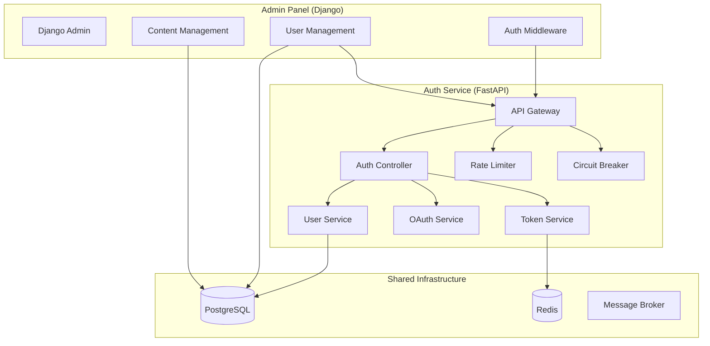

# Рекомендации по структуре проекта для двух сервисов

## Контекст
Проект состоит из двух сервисов:
1. **Auth Service** (FastAPI) - сервис авторизации и аутентификации
2. **Admin Panel** (Django) - административная панель для управления пользователями и контентом

Технологический стек:
- Монорепозиторий
- Docker для контейнеризации
- Общая база данных PostgreSQL
- Redis для кэширования и rate limiting

## Архитектурные принципы

### 1. Clean Architecture для каждого сервиса
Каждый сервис должен следовать принципам Clean Architecture:
- **Entities** - бизнес-сущности (User, Token, Permission)
- **Use Cases** - бизнес-правила и сценарии
- **Interface Adapters** - контроллеры, презентеры, шлюзы
- **Frameworks & Drivers** - веб-фреймворки, базы данных, внешние API

### 2. Микросервисная коммуникация
- REST API для синхронного взаимодействия
- Асинхронные события через брокер сообщений (опционально)
- Circuit Breaker для устойчивости к отказам
- Rate Limiting для защиты API

## Структура монорепозитория

```
auth_sprint_2/
├── .github/                    # CI/CD конфигурации
├── docker/                     # Docker-конфигурации
│   ├── auth-service/
│   │   ├── Dockerfile
│   │   └── docker-compose.yml
│   └── admin-panel/
│       ├── Dockerfile
│       └── docker-compose.yml
├── docs/                       # Документация
├── infrastructure/             # Инфраструктура как код
│   ├── terraform/
│   └── kubernetes/
├── packages/                   # Общие библиотеки
│   ├── shared/
│   │   ├── models/            # Общие модели данных
│   │   ├── utils/             # Общие утилиты
│   │   └── clients/           # HTTP клиенты для межсервисного взаимодействия
│   └── database/
│       └── migrations/        # Общие миграции БД
├── services/                   # Основные сервисы
│   ├── auth-service/          # Сервис авторизации (FastAPI)
│   │   ├── src/
│   │   │   ├── auth/          # Доменный слой аутентификации
│   │   │   ├── oauth/         # OAuth провайдеры
│   │   │   ├── users/         # Управление пользователями
│   │   │   ├── middleware/    # Мидлвари (rate limiting, circuit breaker)
│   │   │   ├── api/           # REST API эндпоинты
│   │   │   ├── core/          # Конфигурация, зависимости
│   │   │   └── tests/         # Тесты
│   │   ├── alembic/           # Миграции БД
│   │   ├── requirements.txt
│   │   └── main.py
│   └── admin-panel/           # Админ-панель (Django)
│       ├── admin_panel/
│       │   ├── apps/
│       │   │   ├── users/     # Модуль пользователей
│       │   │   ├── content/   # Управление контентом
│       │   │   └── auth_integration/ # Интеграция с Auth Service
│       │   ├── settings/
│       │   ├── urls.py
│       │   └── wsgi.py
│       ├── manage.py
│       └── requirements.txt
├── scripts/                    # Вспомогательные скрипты
├── tests/                      # Интеграционные тесты
├── .env.example               # Шаблон переменных окружения
├── .gitignore
├── docker-compose.yml         # Общий docker-compose для разработки
├── Makefile                   # Утилиты для разработки
└── README.md
```

## Схема взаимодействия между сервисами



## Ключевые особенности структуры

### 1. Общие компоненты в `packages/`
- **shared/models** - Pydantic/SQLAlchemy модели для согласованной валидации
- **shared/utils** - утилиты для работы с JWT, хешированием, валидацией
- **shared/clients** - HTTP клиенты с Circuit Breaker и retry логикой

### 2. Изоляция сервисов
- Каждый сервис имеет собственные зависимости (`requirements.txt`)
- Отдельные Docker-образы для каждого сервиса
- Независимое масштабирование

### 3. Общая база данных
- Единая PostgreSQL для обоих сервисов
- Раздельные схемы или префиксы таблиц для изоляции
- Общие миграции в `packages/database/migrations/`

### 4. Конфигурация Docker
```yaml
# docker-compose.yml (разработка)
version: '3.8'
services:
  postgres:
    image: postgres:15
    environment:
      POSTGRES_DB: auth_db
      POSTGRES_USER: auth_user
      POSTGRES_PASSWORD: auth_pass
    
  redis:
    image: redis:7-alpine
    
  auth-service:
    build: ./services/auth-service
    ports:
      - "8000:8000"
    depends_on:
      - postgres
      - redis
    
  admin-panel:
    build: ./services/admin-panel
    ports:
      - "8001:8000"
    depends_on:
      - postgres
      - auth-service
```

## План миграции/реорганизации

### Фаза 1: Создание базовой структуры
1. Создать директории согласно предложенной структуре
2. Настроить общий `docker-compose.yml`
3. Перенести существующий Auth Service в `services/auth-service/`
4. Создать заготовку Admin Panel в `services/admin-panel/`

### Фаза 2: Рефакторинг Auth Service
1. Реорганизовать код по Clean Architecture
2. Вынести общие модели в `packages/shared/`
3. Добавить недостающие эндпоинты (OAuth, introspect)
4. Реализовать rate limiting и circuit breaker

### Фаза 3: Разработка Admin Panel
1. Настроить Django проект с модульной структурой
2. Реализовать аутентификацию через Auth Service
3. Создать CRUD интерфейсы для управления пользователями
4. Добавить интеграцию с Content Service (будущий)

### Фаза 4: Интеграция и тестирование
1. Настроить межсервисное взаимодействие
2. Реализовать fallback механизмы при недоступности Auth Service
3. Написать интеграционные тесты
4. Настроить CI/CD пайплайн

## Преимущества предложенной структуры

1. **Масштабируемость** - каждый сервис можно масштабировать независимо
2. **Поддерживаемость** - четкое разделение ответственности
3. **Переиспользование кода** - общие библиотеки в `packages/`
4. **Упрощенная разработка** - единая команда работает в одном репозитории
5. **Консистентность** - общие стандарты кодирования и конфигурации

## Рекомендации по дальнейшему развитию

1. **Добавить Content Service** - третий сервис для управления контентом
2. **Внедрить брокер сообщений** - RabbitMQ/Kafka для асинхронных событий
3. **Реализовать API Gateway** - для единой точки входа и агрегации запросов
4. **Добавить мониторинг** - Prometheus + Grafana для наблюдения за сервисами
5. **Внедрить distributed tracing** - Jaeger/Zipkin для отслеживания запросов