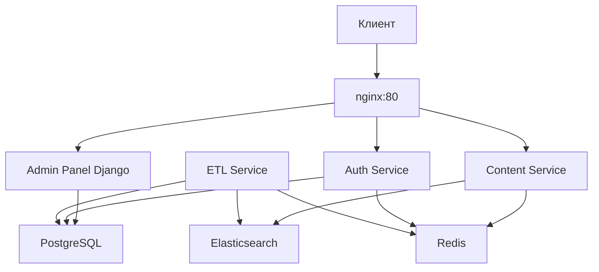

# Рекомендации по оптимизации архитектуры и баз данных

## Обзор системы
Проект представляет собой микросервисную архитектуру для онлайн-кинотеатра с использованием:
- **Auth Service** – аутентификация и авторизация (PostgreSQL + Redis)
- **Content Service** – предоставление информации о фильмах (Elasticsearch + Redis)
- **ETL Service** – перенос данных из PostgreSQL в Elasticsearch
- **Admin Panel** – Django-админка для управления контентом
- **Базы данных**: PostgreSQL, Redis, Elasticsearch

## Выявленные проблемы

### 1. Производительность баз данных
- **PostgreSQL**: отсутствие индексов на часто используемых полях (например, `email` в таблице `users` схемы `public`).
- **Redis**: отсутствие настроек TTL для кэшированных данных, что может привести к накоплению устаревших данных.
- **Elasticsearch**: single-node конфигурация, отсутствие реплик для отказоустойчивости.

### 2. Масштабируемость
- Все сервисы запускаются в одном Docker Compose без балансировки нагрузки.
- Отсутствие репликации PostgreSQL (нет hot-standby).
- Redis и Elasticsearch работают в single-instance режиме.

### 3. Безопасность
- В `.env` установлен `DEBUG=True` для продакшена.
- Секретные ключи (`SECRET_KEY`) имеют значения по умолчанию.
- Отсутствие HTTPS между сервисами.

### 4. Надёжность и отказоустойчивость
- Нет health checks для некоторых сервисов (кроме стандартных в docker-compose).
- ETL-процесс может потерять состояние при сбое (использует Redis для хранения состояния, но нет механизма восстановления).
- Таблица `login_history` может бесконечно расти, что приведёт к замедлению запросов.

### 5. Оптимизация запросов
- Content Service использует Elasticsearch для поиска, но нет кэширования результатов запросов в Redis (только кэширование отдельных объектов).
- В Django admin панели отсутствует оптимизация запросов (например, `select_related`, `prefetch_related`).

## Рекомендации по оптимизации

### 1. Базы данных
#### PostgreSQL
- Добавить индексы:
  - `CREATE INDEX idx_users_email ON public.users (email);`
  - `CREATE INDEX idx_login_history_user_id ON public.login_history (user_id);`
  - Проверить индексы для таблиц в схеме `content` (возможно, добавить составные индексы для частых фильтров).
- Настроить мониторинг медленных запросов (pg_stat_statements).
- Рассмотреть разделение баз данных: выделить отдельную БД для auth и content для изоляции нагрузки.

#### Redis
- Установить TTL для кэшированных данных (например, 5 минут для фильмов, 1 час для жанров).
- Использовать Redis Cluster для горизонтального масштабирования.
- Настроить persistence (RDB/AOF) для предотвращения потери данных.

#### Elasticsearch
- Перейти на multi-node кластер для отказоустойчивости.
- Настроить индексы с репликами (минимум 1 реплика).
- Оптимизировать mapping полей (например, использовать `keyword` для точного поиска).

### 2. Архитектура и инфраструктура
- Ввести балансировщик нагрузки (например, nginx или traefik) перед сервисами.
- Добавить репликацию PostgreSQL с использованием streaming replication.
- Использовать Docker Swarm или Kubernetes для оркестрации контейнеров.
- Настроить мониторинг (Prometheus + Grafana) для отслеживания метрик сервисов и БД.

### 3. Безопасность
- Установить `DEBUG=False` в продакшен-окружении.
- Генерировать уникальные секретные ключи для каждого окружения.
- Внедрить HTTPS с помощью Let's Encrypt или собственных сертификатов.
- Ограничить доступ к административным интерфейсам (admin-panel) по IP.

### 4. Надёжность
- Реализовать механизм очистки устаревших записей в `login_history` (например, удалять записи старше 90 дней).
- Добавить retry-логику с экспоненциальной задержкой для межсервисных вызовов.
- Настроить alerting при сбоях health checks.

### 5. Производительность приложения
#### Auth Service
- Ввести rate limiting для endpoints аутентификации.
- Кэшировать результаты проверки токенов в Redis.

#### Content Service
- Реализовать кэширование результатов поисковых запросов (Elasticsearch → Redis).
- Использовать пагинацию для больших списков.

#### ETL Service
- Увеличить `BATCH_SIZE` до 500–1000 для ускорения загрузки (при достаточном объёме памяти).
- Добавить параллельную обработку нескольких таблиц.

#### Admin Panel
- Оптимизировать Django queries с помощью `select_related` и `prefetch_related`.
- Включить кэширование шаблонов и статики.

### 6. Мониторинг и логирование
- Централизовать логи (ELK stack или Loki).
- Настроить алерты на высокую загрузку CPU/памяти.
- Отслеживать метрики Redis (hit/miss ratio, memory usage).

## Приоритеты внедрения

### Высокий приоритет (критично для стабильности)
1. Отключить DEBUG режим.
2. Добавить индексы в PostgreSQL.
3. Настроить TTL для Redis.
4. Реализовать очистку `login_history`.

### Средний приоритет (улучшение производительности)
1. Балансировщик нагрузки.
2. Кэширование поисковых запросов.
3. Оптимизация ETL batch size.
4. Мониторинг медленных запросов.

### Низкий приоритет (масштабирование)
1. Кластеризация Elasticsearch.
2. Репликация PostgreSQL.
3. Миграция на Kubernetes.

## Диаграмма текущей архитектуры

## Заключение
Предложенные рекомендации направлены на повышение производительности, отказоустойчивости и безопасности системы. Рекомендуется начать с высокоприоритетных задач, затем постепенно внедрять остальные улучшения. Регулярное тестирование под нагрузкой поможет выявить новые узкие места.